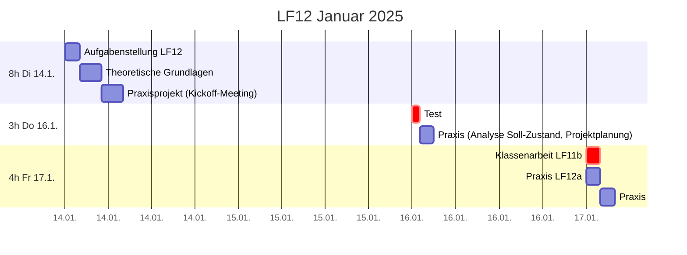
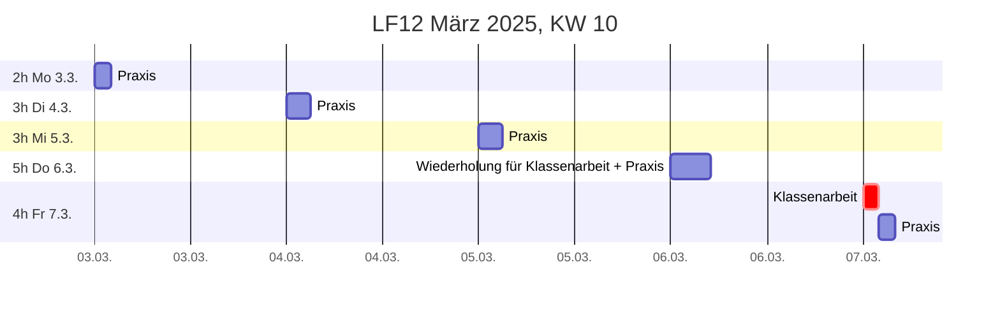
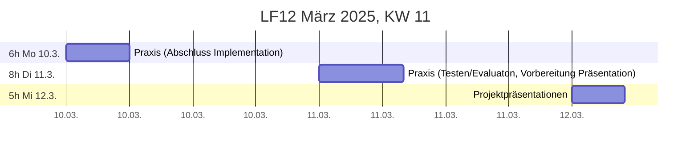

# Organisatorisches

## LF12a + LF12b + PV

##### Theorie
ca 30h
##### Praxisprojekte
ca 30h
##### Prüfungsvorbereitung
ca 60h

## Noten

* 1 Klassenarbeit (90min)
* 3 Sonstige Noten
  * 1 kleiner Test (17.1.)
  * 2 Noten für Projektarbeit
    * Projektergebnis (Teamleistung)
      * fachliche Leistungserbringung gemäß Pflichtenheft
      * Projektmanagement, Dokumentation
    * Mitarbeitsnote (Einzelleistung)
      * Fleiß
      * Selbstständigkeit/Eigeninitiative
      * Gute Fragen + Zwischenergebnisse

## Zeitplan

#### 2025-01-17

|       | Anwendungsentwickler            | Systemintegratoren                 |
| ----- | ------------------------------- | ------------------------------     |
| 1.+2. | Praxisprojekt LF12 (Raum 236)   | **Klassenarbeit** LF11b (Raum 247) |
| 3.+4. | Praxisprojekt LF12  (Raum 247)  | Praxisprojekt LF12 (Raum 247)      |
| 5.+6. | Klassenarbeit LF11a (Raum 236)  | Endpoint Security (Infos für SOL)  |
| 7.+8. | SOL LF11a                       | SOL LF11b (Endpoint Security)      |

## Klassenarbeit Do 6.3.2025 1.+2. DS
* Erlaubte Hilfsmittel:
  * Keine
* Inhalte:
  * „Theorie“ (Kapitel 2) fast vollständig
    * Ausnahmen (bereits am 16.1. abgefragt): 
      * 4-Ohren-Modell
      * Netzplan
* Schwerpunkte:
  * [Projektmerkmale](theorie/grundlagen.md)
  * [Projektmanagementstandards](theorie/grundlagen.md)
  * [Projektphasen](theorie/phasen.md)
  * [Projektplanungsdokumente](theorie/phasen.md)
  * [Magisches Dreieck](theorie/phasen/initiierung.md)
  * [Organisationsformen](theorie/phasen/initiierung/organisationsformen.md)
  * [Vorgehensmodelle](theorie/phasen/initiierung/vorgehensmodelle.md)
  * [IST-/SOLL-Zustand](theorie/phasen/analyse.md)
  * [SMART-Kriterien](theorie/phasen/planung.md)
  * [(nicht)funktonale Anforderungen](theorie/phasen/analyse.md)
  * [Lasten-/Pflichtenheft](theorie/phasen/analyse.md)
  * Zeit-/[Ressourcenplanung](theorie/phasen/planung.md)
  
