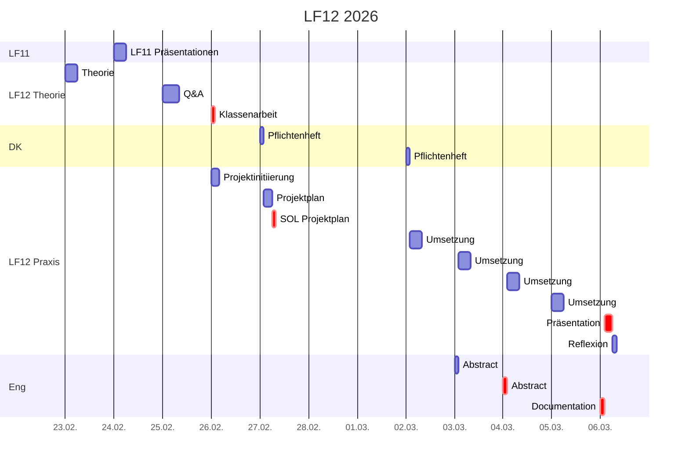

# Organisatorisches

## LF12a + LF12b + PV

##### Theorie
ca 30h
##### Praxisprojekte
ca 30h
##### Prüfungsvorbereitung
ca 60h

## Noten

* 1 Klassenarbeit (90min)
* 3 Sonstige Noten
  * 1 Note auf Projektplan (SOL)
  * 2 Noten für Projektarbeit
    * Projektergebnis (Teamleistung)
      * fachliche Leistungserbringung gemäß Pflichtenheft
      * Projektmanagement, Dokumentation
    * Mitarbeitsnote (Einzelleistung)
      * Fleiß
      * Selbstständigkeit/Eigeninitiative
      * Gute Fragen + Zwischenergebnisse

## Zeitplan

```mermaid
gantt
 title LF12 2026
 dateFormat YYYY-MM-DD
 axisFormat %d.%m.
 section LF11
  LF11 Präsentationen               :2026-02-24, 6h
 section LF12 Theorie
  Theorie                           :2026-02-23, 6h
  Q&A                               :2026-02-25, 8h
  Klassenarbeit                     :crit, t1, 2026-02-26, 2h
 section DK
  Pflichtenheft                     :t2, 2026-02-27, 2h
  Pflichtenheft                     :t3, 2026-03-02, 2h
 section LF12 Praxis
  Projektinitiierung                :after t1, 2026-02-26, 4h
  Projektplan                       :t4, after t2, 4h
  SOL Projektplan                   :crit, after t4, 2h
  Umsetzung                         :after t3, 6h
  Umsetzung                         :after t6, 6h
  Umsetzung                         :after t7, 6h
  Umsetzung                         :2026-03-05, 6h
  Präsentation                      :crit, t5, after t8, 4h
  Reflexion                         :after t5, 2h
 section Eng
  Abstract                          :t6, 2026-03-03, 2h
  Abstract                          :crit, t7, 2026-03-04, 2h
  Documentation                     :crit, t8, 2026-03-06, 2h
```

## Klassenarbeit Do 26.02.2026 3.+4. DS
* Erlaubte Hilfsmittel:
  * Keine
* Inhalte:
  * „Theorie“ (Kapitel 2) fast vollständig
    * Ausnahmen: 
      * 4-Ohren-Modell
      * Netzplan
* Schwerpunkte:
  * [Projektmerkmale](theorie/grundlagen.md)
  * [Projektmanagementstandards](theorie/grundlagen.md)
  * [Projektphasen](theorie/phasen.md)
  * [Projektplanungsdokumente](theorie/phasen.md)
  * [Magisches Dreieck](theorie/phasen/initiierung.md)
  * [Organisationsformen](theorie/phasen/initiierung/organisationsformen.md)
  * [Vorgehensmodelle](theorie/phasen/initiierung/vorgehensmodelle.md)
  * [IST-/SOLL-Zustand](theorie/phasen/analyse.md)
  * [SMART-Kriterien](theorie/phasen/planung.md)
  * [(nicht)funktonale Anforderungen](theorie/phasen/analyse.md)
  * [Lasten-/Pflichtenheft](theorie/phasen/analyse.md)
  * Zeit-/[Ressourcenplanung](theorie/phasen/planung.md)
  
